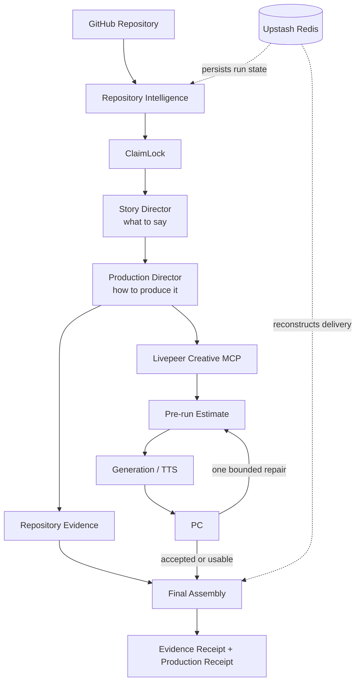

# EchoPitch Studio

**Repository → evidence-grounded autonomous pitch.**

EchoPitch reads a public software repository, determines what the product actually implements, verifies claims against repository evidence, directs a four-scene story from supported claims, uses Livepeer Agent where generated media is warranted, checks generated attempts against a bounded production contract, and delivers a playable HTML pitch with evidence and production receipts.

Built for the Livepeer Agent Hackathon.

## The problem

Software builders often have a working product but still have to manually inspect what is worth showing, decide what can truthfully be claimed, write the story, gather evidence, generate supporting media, record narration, review the result, and assemble a pitch. EchoPitch turns that workflow into one persisted production run without treating repository marketing copy as implementation proof.

## What EchoPitch does

```text
GitHub Repository
→ Repository Intelligence
→ ClaimLock
→ Story Director
→ Production Director
→ Repository Evidence / Livepeer Agent
→ Pitch Critic
→ Final Assembly
→ Evidence Receipt + Production Receipt
```

The landing page accepts a canonical public GitHub repository plus an audience, duration, and pitch goal. The Studio then exposes each operational phase and the evidence behind the resulting story.

## Why Livepeer

Livepeer is EchoPitch's media execution layer, not a decorative integration. The production client connects to the required public Creative MCP endpoint at `https://agent.livepeer.org/api/mcp/creative`, discovers available capabilities, and selects the requested model when it is available.

Before every generated visual or narration segment, EchoPitch proposes the exact `create_media` call through `submit_plan`. Execution is blocked unless Livepeer returns a valid proposed plan with a numeric USD estimate. EchoPitch then approves that same plan, polls it to completion, and records the requested and executed capabilities, plan and job identifiers when returned, raw estimate, output URL, substitutions, latency, and actual cost fields when available. A repaired scene is a new attempt and therefore receives a new estimate.

The current Production Director uses Livepeer image generation for a limited explanatory scene when repository evidence is not presentation-ready. Narration is generated per scene through Livepeer TTS. Repository evidence remains the preferred source everywhere else.

## Core differentiator: ClaimLock

ClaimLock classifies candidate claims as:

- `SUPPORTED`: backed by implementation, configuration, schema, manifest, or repository identity evidence and allowed into narration.
- `PARTIAL`: found only in documentation or problem framing; retained for audit but blocked from narration.
- `UNSUPPORTED`: lacks sufficient evidence and is blocked.

Each accepted claim carries repository evidence paths into the Story Manifest and final Evidence Receipt. README marketing language alone is not treated as proof that a capability is implemented.

## Agent loop

- **Understand** — inspect a bounded set of prioritized repository files and extract product and implementation signals.
- **Verify** — attach evidence to candidate claims and block anything ClaimLock cannot support.
- **Plan** — produce a four-scene Story Manifest shaped by audience, duration, and pitch goal.
- **Produce** — choose repository evidence or Livepeer generation per scene, then generate per-scene narration.
- **Review** — check each generated attempt's instruction and execution metadata against narrative, claim, continuity, artifact, and technical criteria; repair at most once.
- **Deliver** — assemble a playable HTML pitch and persist its evidence and production provenance.

## Architecture



Upstash stores run state for serverless reconstruction. It is not part of repository reasoning or media generation.

## Demo

- **Production deployment:** [echopitch-studio-ten.vercel.app](https://echopitch-studio-ten.vercel.app)
- **Demo video:** coming before final submission.
- **Recommended demo input:** [`sindresorhus/ky`](https://github.com/sindresorhus/ky), used by the current foreign-repository integration gate; it is not hardcoded product behavior.

See the [demo guide](docs/DEMO.md) for the recording sequence.

## Repository structure

```text
/
├── README.md
├── docs/
└── echopitch-studio/   # production Next.js application and Vercel Root Directory
```

Application commands run inside `echopitch-studio`. The root package scripts forward to that directory for convenience.

## Local development

Prerequisites: Node.js 22.14 or newer, npm, and network access to GitHub. Copy `.env.example` to `echopitch-studio/.env.local` and provide values locally; never commit them.

Production persistence requires `UPSTASH_REDIS_REST_URL` and `UPSTASH_REDIS_REST_TOKEN`. `ECHOPITCH_RUN_STORE`, `GITHUB_TOKEN`, `LIVEPEER_MCP_URL`, the three `LIVEPEER_*_CAPABILITY` variables, and Livepeer polling/timeout variables are optional configuration. The Creative MCP currently supports keyless demo access; no Livepeer credential variable is used by the application.

```bash
cd echopitch-studio
npm ci
npm run dev

npm run build
npm run typecheck
npm run lint
npm test
```

The `test:*:live` and Livepeer gate scripts can invoke external services and are intentionally separate from the default test suite.

## Reliability and truthfulness

- Repository inspection is capped at 18 prioritized text files, 80 KB per file, and 360 KB total.
- Only `SUPPORTED` claims with allowed narration enter scenes.
- Repository evidence is preferred; a four-scene manifest currently budgets at most one explanatory Livepeer visual when a suitable candidate exists.
- A valid estimate is mandatory before each Livepeer execution.
- Generated visuals receive at most two attempts: the original plus one bounded repair.
- A failed visual with no usable artifact blocks delivery; narration failure degrades honestly to on-screen copy.
- The final artifact is marked delivered only after assembly and receipts are persisted.
- Receipts use returned identifiers, costs, units, URLs, and failure data; EchoPitch does not fabricate them.

## Tech stack

Next.js 16, React 19, TypeScript, Livepeer Agent Creative MCP, GitHub REST APIs, Upstash Redis, and Tailwind CSS.

## Documentation

- [Product Requirements](docs/PRD.md)
- [Architecture](docs/ARCHITECTURE.md)
- [Livepeer Integration](docs/LIVEPEER.md)
- [ClaimLock](docs/CLAIMLOCK.md)
- [Demo Guide](docs/DEMO.md)
- [Failure Modes](docs/FAILURE-MODES.md)
- [Roadmap](docs/ROADMAP.md)

Repository: [github.com/YakiUdoph/echopitch-studio](https://github.com/YakiUdoph/echopitch-studio)
