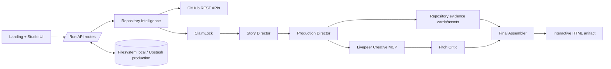
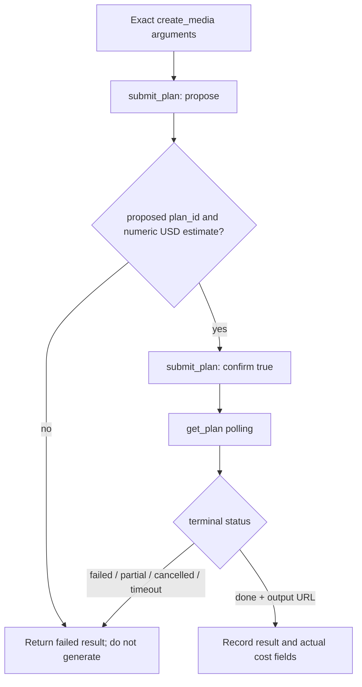

# EchoPitch Studio Architecture

## High-level architecture

EchoPitch is a Next.js App Router application with a browser-facing landing page and Studio, server route handlers, deterministic repository/production modules, a Livepeer Creative MCP client, and pluggable run persistence.



## Request lifecycle

```mermaid
sequenceDiagram
    participant U as Browser
    participant R as Run routes
    participant G as GitHub
    participant L as Livepeer MCP
    participant S as Run store

    U->>R: POST /api/runs (repository + configuration)
    R->>S: create collecting run
    U->>R: POST /api/runs/:id/analyze
    R->>G: metadata, tree, prioritized blobs
    R->>S: understanding → verifying → planning
    U->>R: POST /api/runs/:id/produce
    loop each planned scene
        R->>S: persist current production state
        alt repository evidence
            R->>R: use evidence card or asset reference
        else generated visual
            R->>L: discover → propose exact plan
            L-->>R: plan_id + cost estimate
            R->>L: approve same plan
            R->>L: poll get_plan
            R->>R: critique; optionally repair once
        end
    end
    loop each narrated scene
        R->>L: estimate → approve TTS plan → poll
    end
    R->>R: assemble HTML + receipts
    R->>S: persist delivered run
    U->>R: GET /api/runs/:id/artifact
    R->>S: reload complete run
    R-->>U: reconstructed HTML
```

## Repository Intelligence

The collector accepts one canonical public GitHub repository. It reads repository metadata, a recursive tree, and selected blobs through GitHub's APIs. Selection is deterministic and bounded:

- at most 18 prioritized files;
- at most 80 KB per file;
- at most 360 KB total;
- dependencies, generated output, lockfiles, binaries, media, and oversized files are excluded.

Repository Intelligence extracts identity, summary, documented problem and target user when available, implementation signals, technical mechanisms, evidence records, inspected paths, and limitations. Capability rules intentionally search non-documentation files so documentation alone cannot prove implementation.

## ClaimLock

Candidate claims are linked to explicit evidence or matched conservatively by term overlap. Identity metadata and implementation/configuration evidence can support a claim. Documentation-only capability statements are partial; claims without sufficient evidence are unsupported. Only supported claims with `allowedNarration` enter the Story Manifest.

See [ClaimLock](CLAIMLOCK.md) for the verification contract.

## Story Director: what to say

The Story Director is implemented by `createStoryManifest`. It owns narrative content, not media execution. It:

- creates four ordered scenes;
- distributes the selected duration across them;
- chooses scene purposes from recognized pitch goals;
- adds audience-specific framing to visual intent;
- uses only allowed ClaimLock narration;
- carries claim and evidence IDs into scene provenance;
- records blocked claims separately.

If no allowed claim is available, a scene says “Insufficient evidence” and requests a neutral text card.

## Production Director: how to produce it

The Production Director turns each Story Manifest scene into a media plan and immutable claim-bounded production instruction. This separation exists because deciding **what may be said** is a different responsibility from deciding **how to show it**.

The current four-scene plan scores explanatory moments and budgets at most one generated visual when a candidate exists. A scene can use:

1. a presentation-ready repository asset already present in evidence;
2. a designed repository evidence card; or
3. a Livepeer-generated explanatory image, defaulting to `flux-schnell` unless configured otherwise.

Generated prompts repeat the verified narration, allowed claim IDs, evidence context, and neighboring-scene continuity, and explicitly prohibit invented text, logos, metrics, integrations, or capabilities.

## Livepeer Creative MCP

The client uses `LIVEPEER_MCP_URL`, defaulting to the public Creative MCP endpoint. It initializes MCP, calls `list_capabilities`, and selects the requested capability or a recorded fallback.

Every execution uses an estimate/approval gate:



The proposal itself contains the exact `create_media` arguments later approved as the same plan. Estimate data is retained with the attempt. See [Livepeer Integration](LIVEPEER.md).

## Critic and bounded repair

Only generated visuals enter the critic loop. The current critic is a deterministic production-contract check; it does not inspect image pixels or use a vision model. It checks:

- narrative alignment;
- claim consistency;
- an inspectable HTTPS artifact reference;
- explicit previous/next continuity; and
- completed execution with an executed capability and no error.

An accepted result terminates immediately. A rejected first attempt creates a repair instruction limited to failed criteria while preserving claims and evidence. The second attempt is final. If either attempt has a usable output but the final contract check still misses a criterion, the scene is marked `WARNING` and may assemble; if no usable output exists, the scene is `FAILED` and delivery is blocked.

## Narration architecture

Narration is produced after visual review. Each non-empty scene narration becomes an independent Livepeer TTS instruction, currently requesting `gemini-tts` by default. Each segment goes through the same capability discovery, estimate, approval, polling, and cost-recording path as visual generation.

The assembler embeds narration only if all required segments succeeded, still match their scene text, and have output references. Any incomplete set becomes on-screen copy only. There is no narration repair loop.

## Final assembler

Final Assembly validates that every scene has production data and that every generated visual has a usable artifact. It creates a standalone interactive HTML document containing:

- ordered scenes and exact durations;
- generated visuals or repository evidence cards;
- narration copy and complete per-scene audio when available;
- Play/Pause/Resume, Seek, and Restart controls;
- playback diagnostics and a visible recovery message when audio is blocked.

The artifact route reconstructs this HTML from persisted structured state, returns it inline or as a download, marks it private/no-store, and applies a restrictive content security policy. Untrusted JSON is escaped before insertion into the script.

## Persistence and serverless reconstruction

The `RunStore` abstraction saves the entire `PitchRun`. Local development defaults to JSON files under `.data/runs`. Production, an explicit Upstash configuration, or detected Upstash credentials selects Redis.

The production route persists the media plan and instructions before execution, then persists the accumulated scene list after each scene. A delivered run contains repository intelligence, ClaimLock, Story Manifest, media plan, instructions, productions, narration, final assembly, and production receipt. The artifact is regenerated from this state on each artifact request rather than relying on process memory.

Upstash is therefore durability infrastructure for serverless requests. It does not reason about claims and does not execute media generation.

## Receipts and provenance

The Evidence Receipt is derived from Story Manifest claim/evidence references. The Production Receipt records source choice, requested and executed capabilities, returned job IDs, attempt counts, critic verdicts, repair history, output URLs, latency, failures, substitutions, cost estimates, actual cost/unit fields when provided, narration state, and final assembly state.

Raw estimate responses also remain inside the persisted generation attempt. Optional fields preserve compatibility with older stored runs.

## Failure boundaries

- Run creation rejects malformed repository/configuration input before persistence.
- Analysis failures move the run to `failed` with the real error.
- Livepeer initialization, discovery, estimate, approval, polling, and output failures become failed generation results.
- Visual generation can repair once; unusable scenes block delivery.
- Narration failure does not claim success and degrades to on-screen copy.
- Missing production state blocks artifact reconstruction.
- Store failures are not masked; if state cannot be written, successful delivery is not confirmed.

Detailed behavior is catalogued in [Failure Modes](FAILURE-MODES.md).
