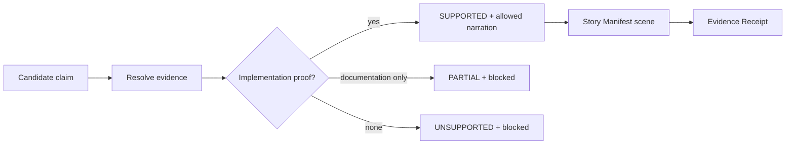

# ClaimLock

## Motivation

A repository can contain code, configuration, metadata, and aspirational documentation at the same time. A pitch generator that treats every README sentence as shipped behavior can produce a polished but unsupported story. ClaimLock is the boundary between repository interpretation and narration: a claim must pass verification before the Story Director may say it.

## Inputs

Repository Intelligence produces structured evidence records with:

- a stable evidence ID;
- repository path;
- evidence kind (`metadata`, `documentation`, `manifest`, `source`, `configuration`, or `schema`);
- a compact excerpt;
- the reason it is relevant; and
- a GitHub URL.

Candidate claims are derived from repository identity, documented problem framing, detected capabilities, technical mechanisms, combined differentiators, and optional external claims. Detected implementation claims already carry the evidence IDs that produced them.

## Verification

ClaimLock first resolves explicitly linked evidence. If none is linked, it performs a conservative keyword-overlap search across known evidence and returns at most four relevant records. It then separates implementation evidence from documentation and metadata.

The implemented decisions are:

| Status | Rule | Narration |
| --- | --- | --- |
| `SUPPORTED` | Repository identity is confirmed by GitHub metadata, or implementation/configuration/schema/manifest evidence directly supports a conservative claim. | Allowed when `allowedNarration` is present. |
| `PARTIAL` | The statement appears only in documentation, or is problem framing without independent implementation evidence. | Blocked. |
| `UNSUPPORTED` | No sufficient evidence was found. | Blocked. |

Confidence is recorded, but status and allowed narration—not confidence alone—control admission to the story.

## Conservative handling

Current ClaimLock does not ask a model to embellish or broadly rewrite a weak claim. A supported conservative claim is allowed as written. Partial and unsupported claims remain visible for audit with their reason, but receive no allowed narration and are placed in `blockedClaimIds`.

This means README marketing language alone cannot become an implementation claim. Problem framing found only in documentation may inform the intelligence report, but it is not narrated as verified product behavior.

## Evidence paths and provenance

Every supported scene stores its claim ID and evidence IDs. The Story Manifest aggregates those links into a provenance list. Production instructions repeat the allowed claims and evidence context, the critic checks that instruction claim IDs remain allowed, and the Studio's Evidence Receipt resolves the IDs back to repository paths and URLs.

## Generic example

Consider the hypothetical claim “Provides an HTTP API.”

- If `src/api.ts` contains an implemented request handler, ClaimLock can mark the claim `SUPPORTED` and attach that source path.
- If the sentence appears only in `README.md`, ClaimLock marks it `PARTIAL` and blocks it from narration.
- If neither code nor documentation supports it, ClaimLock marks it `UNSUPPORTED` with “Insufficient evidence.”

This example mirrors the deterministic test fixture; it is not a claim about a real external repository.

## Relationship to the Story Manifest

The Story Director receives both the full claim audit and the list of allowed claim IDs. Scenes can use only claims that are supported and have allowed narration. Blocked claims are retained in the manifest's `blockedClaims` section so exclusion is observable. If no claim is available for a scene, the implementation emits “Insufficient evidence” and requests a neutral text card instead of inventing a fallback story.

## Limits

ClaimLock is a deterministic evidence policy, not a formal proof system. Its capability extraction and fallback evidence search use repository patterns and keyword overlap, so they can miss unusual implementations or associate broad terms imperfectly. The bounded file collector may also omit relevant files. These limitations are surfaced in Repository Intelligence rather than hidden.
